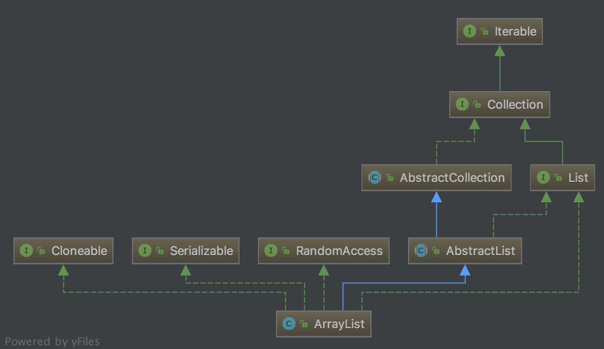

# ArrayList

# 总体介绍



*ArrayList*实现了*List*接口，是顺序容器，即元素存放的数据与放进去的顺序相同，允许放入`null`元素，底层通过**数组实现**。除该类未实现同步外，其余跟*Vector*大致相同。每个*ArrayList*都有一个容量（capacity），表示底层数组的实际大小，容器内存储元素的个数不能多于当前容量。当向容器中添加元素时，如果容量不足，容器会自动增大底层数组的大小。前面已经提过，Java泛型只是编译器提供的语法糖，所以这里的数组是一个Object数组，以便能够容纳任何类型的对象。


size(), isEmpty(), get(), set()方法均能在常数时间内完成，add()方法的时间开销跟插入位置有关，addAll()方法的时间开销跟添加元素的个数成正比。其余方法大都是线性时间。

为追求效率，ArrayList没有实现同步（synchronized），如果需要多个线程并发访问，用户可以手动同步，也可使用Vector替代。

# 方法剖析

## set()

既然底层是一个数组*ArrayList*的`set()`方法也就变得非常简单，直接对数组的指定位置赋值即可。
```java
public E set(int index, E element) {
    rangeCheck(index);//下标越界检查
    E oldValue = elementData(index);
    elementData[index] = element;//赋值到指定位置，复制的仅仅是引用
    return oldValue;
}
```

## get()

`get()`方法同样很简单，唯一要注意的是由于底层数组是Object[]，得到元素后需要进行类型转换。
```java
public E get(int index) {
    rangeCheck(index);
    return (E) elementData[index];//注意类型转换
}
```

## add()

跟C++ 的*vector*不同，*ArrayList*没有`push_back()`方法，对应的方法是`add(E e)`，*ArrayList*也没有`insert()`方法，对应的方法是`add(int index, E e)`。这两个方法都是向容器中添加新元素，这可能会导致*capacity*不足，因此在添加元素之前，都需要进行剩余空间检查，如果需要则自动扩容。扩容操作最终是通过`grow()`方法完成的。
```java
private void grow(int minCapacity) {
    int oldCapacity = elementData.length;
    int newCapacity = oldCapacity + (oldCapacity >> 1);//原来的1.5倍
    if (newCapacity - minCapacity < 0)
        newCapacity = minCapacity;
    if (newCapacity - MAX_ARRAY_SIZE > 0)
        newCapacity = hugeCapacity(minCapacity);
    elementData = Arrays.copyOf(elementData, newCapacity);//扩展空间并复制
}
```
由于Java GC自动管理了内存，这里也就不需要考虑源数组释放的问题。


空间的问题解决后，插入过程就显得非常简单。


`add(int index, E e)`需要先对元素进行移动，然后完成插入操作，也就意味着该方法有着线性的时间复杂度。

## addAll()

`addAll()`方法能够一次添加多个元素，根据位置不同也有两个版本，一个是在末尾添加的`addAll(Collection<? extends E> c)`方法，一个是从指定位置开始插入的`addAll(int index, Collection<? extends E> c)`方法。跟`add()`方法类似，在插入之前也需要进行空间检查，如果需要则自动扩容；如果从指定位置插入，也会存在移动元素的情况。
`addAll()`的时间复杂度不仅跟插入元素的多少有关，也跟插入的位置相关。

## remove()

`remove()`方法也有两个版本，一个是`remove(int index)`删除指定位置的元素，另一个是`remove(Object o)`删除第一个满足`o.equals(elementData[index])`的元素。删除操作是`add()`操作的逆过程，需要将删除点之后的元素向前移动一个位置。需要注意的是为了让GC起作用，必须显式的为最后一个位置赋`null`值。
```java
public E remove(int index) {
    rangeCheck(index);
    modCount++;
    E oldValue = elementData(index);
    int numMoved = size - index - 1;
    if (numMoved > 0)
        System.arraycopy(elementData, index+1, elementData, index, numMoved);
    elementData[--size] = null; //清除该位置的引用，让GC起作用
    return oldValue;
}
```
关于Java GC这里需要特别说明一下，**有了垃圾收集器并不意味着一定不会有内存泄漏**。对象能否被GC的依据是是否还有引用指向它，上面代码中如果不手动赋`null`值，除非对应的位置被其他元素覆盖，否则原来的对象就一直不会被回收。


